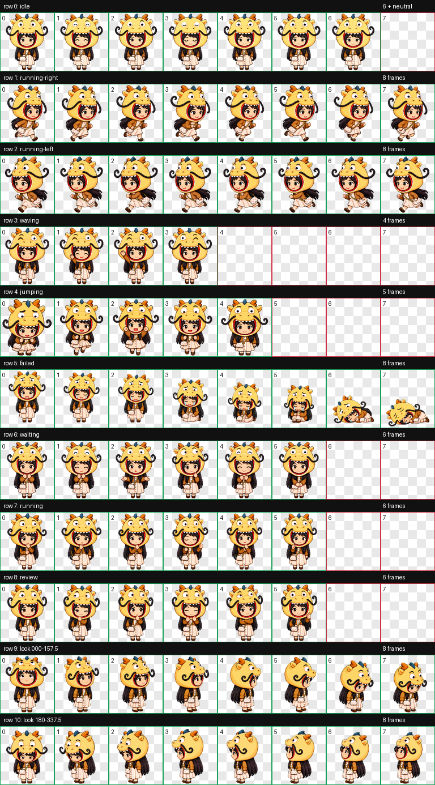
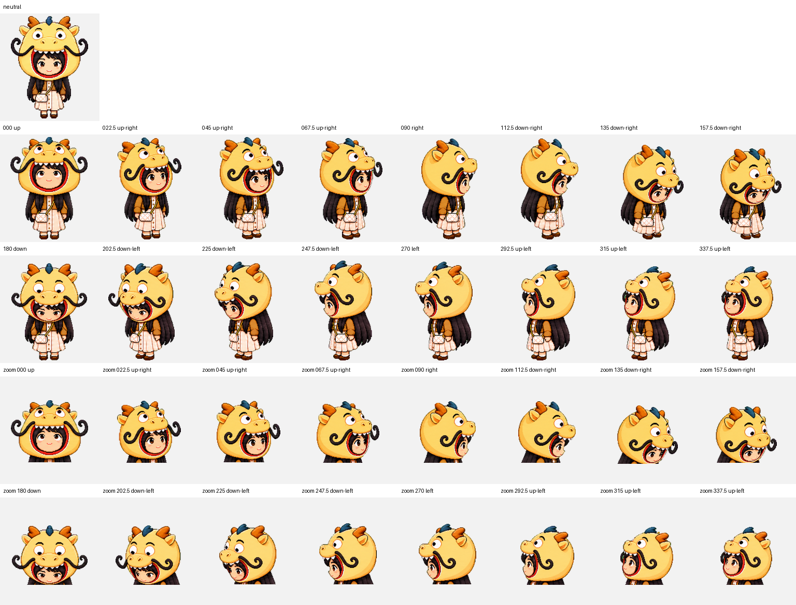

# Keep Them Close

> Turn someone you care about into a respectful Codex pet — a friend, a family member, or someone you still carry with you.

[Chinese README](README.zh-CN.md) · [Complete tutorial](docs/tutorial.md) · [Install the skill](#install-the-skill) · [Dragon Hood Girl example](examples/dragon-hood-girl/README.md)



This repository contains two things:

1. `make-keepsake-pet`, a reusable Codex skill that guides the consent, identity, emotional-design, generation, QA, and packaging workflow.
2. Dragon Hood Girl, a complete v2 example with a working `pet.json`, an 8×11 spritesheet, nine animation states, and sixteen cursor-relative look directions.

The goal is not to produce a generic avatar. It is to preserve the details that make someone recognizable: a familiar expression, a favorite garment, the way an accessory moves, or a small shared joke.

## What the pet can do


The Codex v2 pet contract uses `192×208` cells in an `8×11` atlas (`1536×2288` total):

| Row | State | Typical app condition |
| ---: | --- | --- |
| 0 | `idle` | Default loop and fallback |
| 1 | `running-right` | Pet/window dragged toward screen-right |
| 2 | `running-left` | Pet/window dragged toward screen-left |
| 3 | `waving` | First-awake greeting |
| 4 | `jumping` | Pointer hover |
| 5 | `failed` | Visible danger or blocked state |
| 6 | `waiting` | Approval, permission, plan, or user input needed |
| 7 | `running` | Task is processing; this is not literal locomotion |
| 8 | `review` | Completed output is ready or unread |
| 9–10 | look directions | Sixteen clockwise cursor-relative gaze poses |

Some reactions are brief and event-specific, so a pet may appear to use only idle, running, and waving during casual observation. The artwork is still present; the app plays a non-idle reaction a few times and then visually returns to idle.



## Try Dragon Hood Girl

On macOS:

```bash
mkdir -p "$HOME/.codex/pets/dragon-hood-girl"
cp examples/dragon-hood-girl/package/pet.json "$HOME/.codex/pets/dragon-hood-girl/pet.json"
cp examples/dragon-hood-girl/package/spritesheet.webp "$HOME/.codex/pets/dragon-hood-girl/spritesheet.webp"
```

Restart or reload Codex, then choose the installed **Dragon Hood Girl** pet from the pet selector. Deleting this cloned repository later does not delete the installed copy under `~/.codex/pets/dragon-hood-girl`.

## Install the skill

```bash
mkdir -p "$HOME/.codex/skills"
cp -R skill/make-keepsake-pet "$HOME/.codex/skills/make-keepsake-pet"
```

Then ask Codex:

```text
Use $make-keepsake-pet to turn my approved photos and memories into a private Codex pet.
```

The skill expects a current `hatch-pet` workflow to be available in Codex. It adds the human-centered intake and identity-preservation layer; `hatch-pet` remains responsible for deterministic sprite assembly, direction QA, validation, and installation.

## Make your own

Start with [the complete tutorial](docs/tutorial.md). The short version is:

1. Obtain permission and decide whether the result stays private.
2. Choose 3–8 clear reference images and write a short memory brief.
3. Separate identity anchors from optional styling.
4. Give the person and any expressive prop coordinated animation roles.
5. Build all nine states and sixteen look directions with `hatch-pet`.
6. Inspect contact sheets and GIFs at actual pet size.
7. Keep source photos out of a public repository unless every relevant person has clearly agreed.

## Privacy and consent

- For a living person, get explicit permission before using or publishing their likeness.
- For a memorial pet, keep the working folder private by default and consult family or rights holders before sharing it.
- Do not imitate a person's voice, claim the pet speaks for them, or use private messages as training material without permission.
- Remove photo metadata and never commit raw source photos, tokens, account data, or private chat logs to a public repository.

See [Privacy, consent, and memorial care](docs/privacy-and-consent.md).

## License

The skill and written documentation are released under the [MIT License](LICENSE). The Dragon Hood Girl example artwork and spritesheet are included for demonstration and personal installation only and are excluded from the MIT grant; see [the asset notice](examples/dragon-hood-girl/ASSET_NOTICE.md).

## A final note

Some pets are simply playful little characters. Others hold a familiar expression at the edge of the screen. They cannot replace a person, preserve a whole life, or speak on anyone's behalf. But made with permission, care, and restraint, they can keep one small piece of warmth nearby — a gentle reminder of how someone made us feel.
