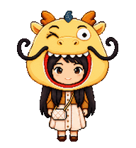
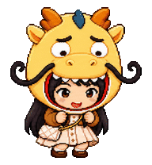
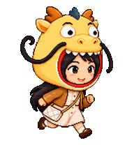
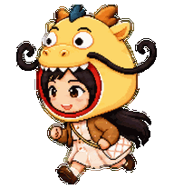

# Dragon Hood Girl v2.3 example

Dragon Hood Girl is a humanoid chibi pet whose plush dragon hood is also a second expressive face. The two faces coordinate across every supported state and all sixteen look directions.



The showcase cycles through all nine standard states with GIF-safe transparency and no chroma-key fringe.


## Identity lock

- full, rounded pale-yellow plush dragon hood;
- orange horns and ears, dark-blue crest;
- giant white dragon eyes, black pupils and brows;
- beige nostrils, white teeth, red lining;
- two attached matte-black cloth whiskers with upward C/S curls;
- long black hair, brown jacket, cream dress, and white crossbody bag.

The source photographs are intentionally not included in this public example.

## Expressive design

The dragon hood is treated as a second face rather than an inert costume. It joins the girl's blink, gaze, greeting, surprise, sadness, waiting, focus, and satisfied review. The black cloth whiskers keep their material and color and follow movement with a restrained lag.

### Failed state


The eight-frame story moves from standing sadness through attached tears, sinking knees, kneeling, seated curl, side roll, and a final side-prone fetal curl. Both faces close their eyes together.

### Other state previews

| Greeting | Waiting | Task running | Review |
| --- | --- | --- | --- |
|  |  |  |  |

| Hover jump | Drag right | Drag left |
| --- | --- | --- |
|  |  |  |

## Look mechanics


The girl's eyes lead, followed by eyelids, brows, a restrained head/neck turn, and slight upper-body motion. The dragon face follows the same screen direction. Hair and whiskers lag subtly; feet, bag side, scale, and baseline stay stable. The whole sprite is never rotated or warped to fake gaze.

## Package

`package/` is directly installable:

On native Windows PowerShell, run this from the repository root:

```powershell
.\scripts\install-windows.ps1 -PetOnly
.\scripts\verify-windows.ps1 -PetOnly
```

On macOS, Linux, or WSL2:

```bash
mkdir -p "$HOME/.codex/pets/dragon-hood-girl"
cp package/pet.json "$HOME/.codex/pets/dragon-hood-girl/pet.json"
cp package/spritesheet.webp "$HOME/.codex/pets/dragon-hood-girl/spritesheet.webp"
```

The package is platform-neutral: it contains only JSON and WebP files with a relative `spritesheetPath`. The atlas is `1536×2288`, arranged as `8×11` cells of `192×208`, and the manifest declares `spriteVersionNumber: 2`.
